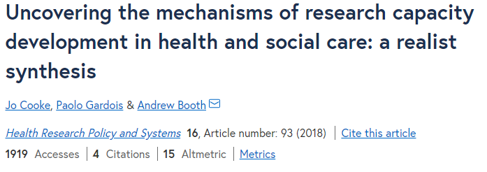

---

output:
  xaringan::moon_reader:
    lib_dir: libs
    css: ["custom.css", "default.css", "fonts.css"]
    nature:
      highlightStyle: github
      highlightLines: true
      countIncrementalSlides: false
    seal: false

---

class: inverse, center, title-slide, middle

<style>
.title-slide .remark-slide-number {
  display: none;
}
</style>

<div class="my-logo-left"></div>

<div class="my-logo-right"></div> 

# HMRI Research Support System Design
## Increasing Clinician Research Capability

### Chris Oldmeadow, Chris Williams, Chris Grainge, Vanessa McDonald, Luke Wolfenden 

 
### `r Sys.Date()`


---


```{r setup, include=FALSE, fig.retina = 3}
options(htmltools.dir.version = FALSE)
library(knitr)
#knitr::opts_chunk$set(cache = TRUE, warning = FALSE, message = FALSE, dpi = 180)
library(ggplot2)
#library(silgelib)
library(emo)


```


 
# What is the current problem?


-  HMRI is to increase the amount of T3-T4 translation research
- `r emo::ji("demon")`  There are no/limited pathways for clinicians to develop research capability
- `r emo::ji("demon")`  Blockages at the interface between HNELHD, UoN and HMRI 


---
class: inverse 
 
# What is the purpose of this exploration?

--


.content-box-blue[ 
 To develop a prototype model where HMRI can facilitate research pathways/ capability development for clinicians within the HNELHD. 
]

Benefits:
- To UoN: More grant funding, higher quality papers, more papers accepted
- To HNE: Better patient care

---
class: inverse
 
# Critical Questions? 

--
- Who are the key stakeholders (either help or hinder)?
- What are the stakeholder and organisational objectives?
- Are we trying to train better researchers or do better clinically relevant research
- How do we engage stakeholders and get commitment?


---
# Critical Questions? 

- How do we define research capacity/capability development?
- What is the span of operation and activities (individual, organisation, network)?
- What are the mechanisms that support meaningful research capability development ?

---
# Critical Questions? 
- What are the barriers to the implementation of any system/framework?
  - How to motivate a research environment?
  - How to support research naive groups?

- How to measure impact?
   - Different to "knowledge mobilisation"? 
   - KM: to what extant does the generated research change practice


---

# Key stakeholders to speak to

- Peter Pockney (UoN/HNE - surgery)
- Liz Sullivan (UoN)
- John Attia (UoN/HNE)
- John wiggers (UoN/HNE)
- Maralyn Foureur (Uon/HNE nursing)
- Allied health?
- Consumers
---

# What is research capability development (what works and why)?


* RCD: a set of purposefully coordinated components that target multiple levels and sectors of a system, that operate both independently and inter-dependently
* empowering and enabling different levels of the health research system to conduct research

---
# What are the possible components to the system:
  - Prioritisation of research areas / clinical problems; 
  - Mentoring for research; 
  - Research leadership; 
  - Research facilitation; 
  - Research skills training; 
  - Funding (including philanthropy, grants and fellowships); 
  - Networks and collaborations; Infrastructure.


---
# Program theories 

Signalling the importance of Research Capability Development

- Positive role models
- signal importance (Eg protected time)
- fealing that you make a difference

Functional aspects:

- Liberate talents
- Release Resources
- Learning by doing
- Co-production of knowledge


---


---
# A Clinical fellowship model
## Summary from Pete Pockney

- Clinical Research Fellowship for trainee surgeons
- Introduced to increase rates of acceptance into Advanced training
- Potentially transferable to other areas in medicine
- works well when jobs can be split
- clinician takes a hit in pay 
- Key aspects: Administration, Projects
- Risks : In other areas, retaining these researchers as clinicians

---
# A potential model for JMO's (similar to UK system)
- A research rotation, competitively applied for
- Would need agreement from administration (HNE)
- Would need a funding model (philanthropy) - splitting jobs?


---
#  Alternative ways to achieve the purpose 

- secondments
- team based, e.g. the embedded economist/statistician/implementation scientist
- alternatively embedded clinician in lab based teams 
- utilising/adapting current resource


---
# Where to from here?
- Further meetings
- Potentially a systematic review
- Down the track, consider an evaluation of the system

---


